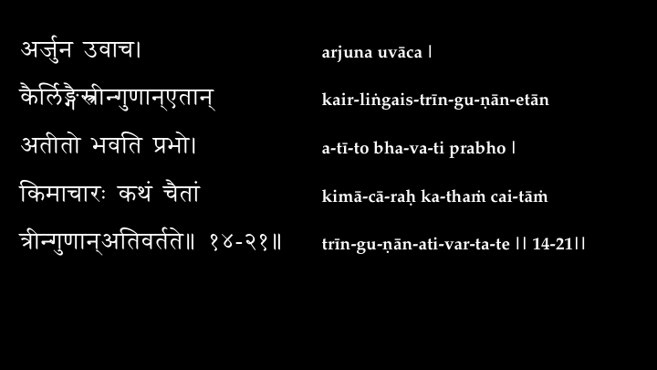

# plaintext-to-pptx

PowerPoint slide generator that parses plaintext files line by line. Specifically designed for typesetting Indic fonts like Devanagari.


## Requirements

- Your UTF-8 plaintext files
- Node.js 4.x (visit [Nodejs.org](https://nodejs.org/en/))
- [PptxGenJS](https://gitbrent.github.io/PptxGenJS/) via `npm install pptxgenjs`
- [Itranslator 2003](https://omkarananda-ashram.org/Sanskrit/itranslator2003.htm) (optional)
  -  [Wine Bottler](http://winebottler.kronenberg.org) for Macs (optional)

## Fonts

The following default fonts work well for Devanagari texts, especially for Vedik accents used in chanting:

- `Siddhanta`for Devanagari ([link](http://www.sanskritweb.net/itrans/#SIDDHANTA))
- `URW Palladio ITU` for Romanized ([link](http://www.sanskritweb.net/itrans/#ITU))


## Usage

From the command line:

`node pptxgen.js <config.js> <devanagari-file> <roman-file>`

This will generate an output `pptx` file in the same folder as the first input file.

## Layouts

Three default layouts are included for convenience.

#### config-horiz_full

Full slide horizontal layout, left justified. Accommodates the largest amount of characters/line.


#### config-horiz_top

Horizontal layout only using the top of the slide, center-justified. Two rows only, useful for projecting lyrics in realtime.


#### config-two_cols_top

Two column vertical layout using the upper part of the slide. Useful for projecting verses.

Note the left column is smaller in width, since typically the romanized equivalent will take more space.



## Example

The `sample` folder contains an excerpt of Gita Chapter 14, with already-generated plaintext UTF-8 files. The following command generates a PowerPoint presentation in the default two column layout:

`node pptxgen.js config-two_cols_top.js sample/gita-chap-14/dev.txt sample/gita-chap-14/rom.txt`


## Features

- Non-trailing hyphens in Devanagari text (often used for syllables in transliteration) are automatically removed
- All text is trimmed (from the left and right) before added to the slide 
- Lines only containing whitespace are treated as blank lines
- Consequetive blank lines greater than `NEW_SLIDE_BLANK_LINE_COUNT` will trigger a slide break
- Lines that *start with* `TITLE` (case-sensitive) will be centered in large font


## Walkthrough

1. Generate two text files, with an identical number of lines
2. Plaintext files should be saved as UTF-8 (can be checked with `file -I <path-to-file>`)
3. Create/modify a `config.js` file with the font type, size, etc.
4. Invoke the program and the output PPTX file will be written in the same folder

## Unicode Texts and ITranslator 2003

For Sanskrit texts, [Itranslator 2003](https://omkarananda-ashram.org/Sanskrit/itranslator2003.htm) is very popular in generating Unicode Devanagari and Romanized plaintext files.

### Mac Tips


On Macs, Itranslator 2003 can be run via [Wine Bottler](http://winebottler.kronenberg.org) without needing to install Windows on any virtual machine like Parallels, etc. For Wine Bottler programs,`CTRL-C` and `CTRL-V` are used to copy/paste rather than `COMMAND-C` and `COMMAND-V`.

By default, when running Itranslator 2003 through Wine Bottler, files are saved with UTF-16 encoding. In such cases, saving it to richtext (`.rtf`) first and converting it to plaintext with TextEdit (keyboard shortcut `COMMAND-SHIFT-T`) flattens it to UTF-8.

### Forcing Blank Lines with ITranslator

By default, ITranslator removes all whitespace between lines. This makes forcing new slides with `NEW_SLIDE_BLANK_LINE_COUNT` difficult, since consecutive blank lines in the input `.itx` file will be flattened.

Trying to indicate three blank lines with:

```


```

creates a flattened output of:

```

```

Instead, use the `#` comment character to place a blank space in between a line on the input:

```

## ##

```

The resulting output from ITranslator will indeed be three blank lines:

```


```

This trick can be used for as many lines as needed, as long as it contains with the space comment `## ##` in the middle.